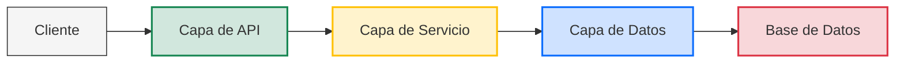
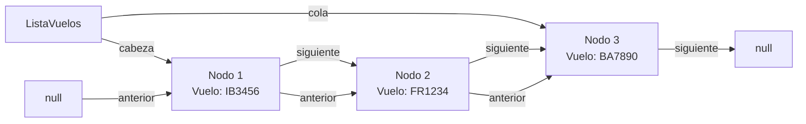
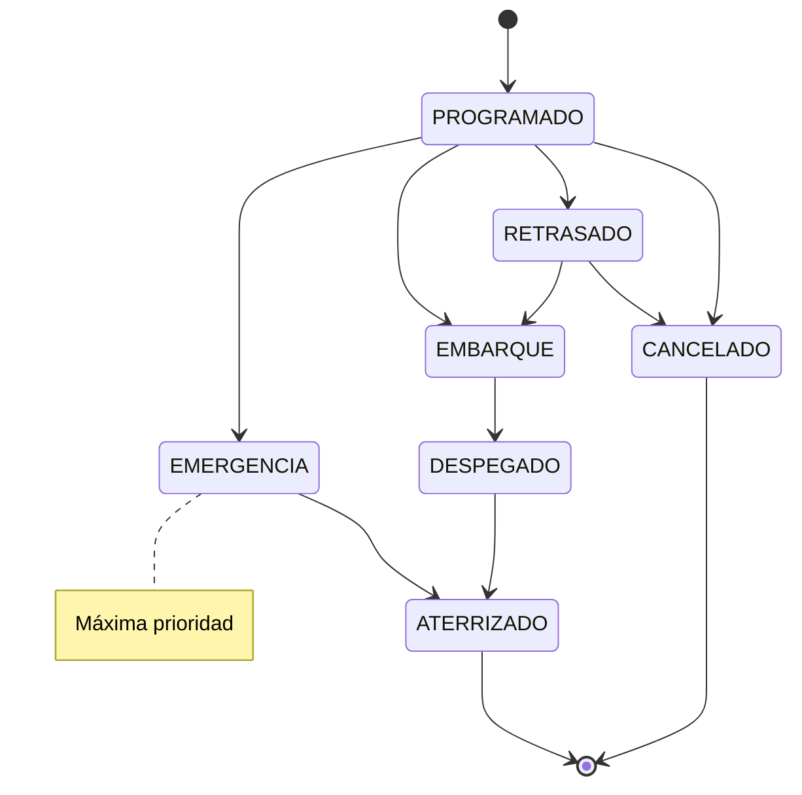
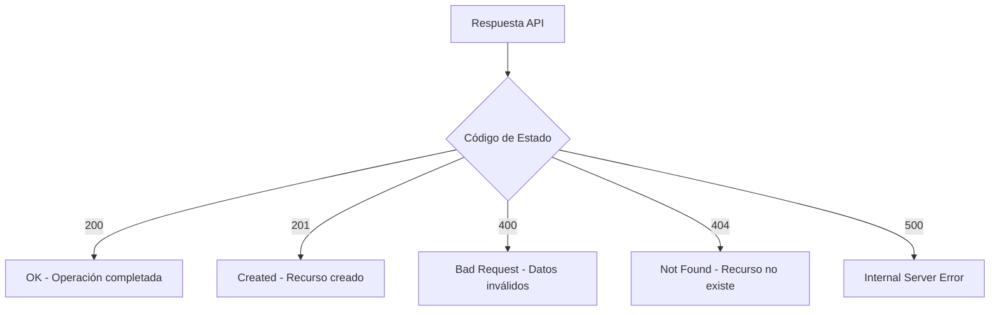
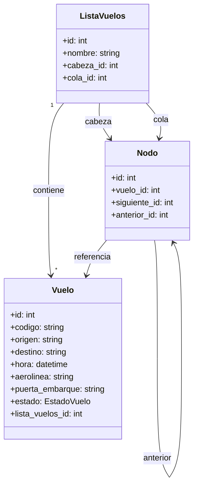

# Documentación de la API del Sistema de Gestión de Aeropuerto

## Descripción General

Esta API gestiona los vuelos de un aeropuerto utilizando una estructura de datos de lista doblemente enlazada. Permite operaciones 
como añadir, eliminar y reordenar vuelos, así como priorizarlos según su estado.

## Arquitectura

El sistema sigue una arquitectura por capas:



1. **Capa de API** - Endpoints FastAPI para operaciones con vuelos
2. **Capa de Servicio** - Lógica de negocio y operaciones sobre la lista enlazada
3. **Capa de Datos** - Modelos SQLAlchemy y operaciones de base de datos

## Implementación de Lista Enlazada

Los vuelos están organizados en una lista doblemente enlazada donde:



- Cada nodo contiene un vuelo y punteros a los nodos anterior y siguiente
- La lista mantiene punteros a cabeza y cola para operaciones eficientes
- Las operaciones incluyen inserción/eliminación en ambos extremos y en posiciones específicas

## Endpoints Disponibles

### Información de Vuelos

- `GET /api/vuelos/`: Lista todos los vuelos en la base de datos
  - Parámetros: `skip` (opcional), `limit` (opcional)
  - Respuesta: Array de objetos Vuelo
  - Ejemplo: `GET /api/vuelos/?skip=0&limit=10`

- `GET /api/vuelos/{vuelo_id}`: Obtiene detalles de un vuelo específico
  - Parámetros: `vuelo_id` (en la URL)
  - Respuesta: Objeto Vuelo
  - Ejemplo: `GET /api/vuelos/5`

- `POST /api/vuelos/`: Crea un nuevo vuelo
  - Cuerpo: Datos del vuelo (JSON)
  - Respuesta: Objeto Vuelo creado
  - Ejemplo:
    ```json
    {
      "codigo": "IB3456",
      "origen": "Madrid",
      "destino": "Barcelona",
      "estado": "programado",
      "aerolinea": "Iberia"
    }
    ```

- `PATCH /api/vuelos/{vuelo_id}/estado`: Actualiza el estado de un vuelo
  - Parámetros: `vuelo_id` (en la URL)
  - Cuerpo: Nuevo estado
  - Respuesta: Objeto Vuelo actualizado
  - Ejemplo:
    ```json
    {
      "estado": "embarque"
    }
    ```

### Operaciones de Lista Enlazada

- `GET /api/vuelos/total`: Obtiene el número total de vuelos en la lista
  - Parámetros: `lista_id` (opcional, por defecto: 1)
  - Respuesta: `{"total": número}`
  - Ejemplo: `GET /api/vuelos/total?lista_id=1`

- `GET /api/vuelos/proximo`: Obtiene el próximo vuelo (primero en la lista)
  - Parámetros: `lista_id` (opcional, por defecto: 1)
  - Respuesta: Objeto Vuelo
  - Ejemplo: `GET /api/vuelos/proximo?lista_id=1`

- `GET /api/vuelos/ultimo`: Obtiene el último vuelo en la lista
  - Parámetros: `lista_id` (opcional, por defecto: 1)
  - Respuesta: Objeto Vuelo
  - Ejemplo: `GET /api/vuelos/ultimo?lista_id=1`

- `GET /api/vuelos/lista`: Obtiene todos los vuelos recorriendo la lista enlazada
  - Parámetros: `lista_id` (opcional, por defecto: 1)
  - Respuesta: Array de objetos Vuelo
  - Ejemplo: `GET /api/vuelos/lista?lista_id=1`

- `POST /api/vuelos`: Añade un vuelo al principio o al final de la lista
  - Parámetros: 
    - `position` (string, opcional): "first" o "last" (por defecto: "last")
    - `lista_id` (opcional, por defecto: 1)
  - Cuerpo: Datos del vuelo (JSON)
  - Respuesta: Objeto Vuelo añadido
  - Ejemplo: `POST /api/vuelos?position=first&lista_id=1`

- `POST /api/vuelos/insertar`: Inserta un vuelo en una posición específica
  - Parámetros:
    - `position` (número): Posición donde insertar (0-indexado)
    - `lista_id` (opcional, por defecto: 1)
  - Cuerpo: Datos del vuelo (JSON)
  - Respuesta: Objeto Vuelo insertado
  - Ejemplo: `POST /api/vuelos/insertar?position=2&lista_id=1`

- `DELETE /api/vuelos/extraer`: Extrae un vuelo de una posición específica
  - Parámetros:
    - `position` (número): Posición de donde extraer (0-indexado)
    - `lista_id` (opcional, por defecto: 1)
  - Respuesta: Objeto Vuelo extraído
  - Ejemplo: `DELETE /api/vuelos/extraer?position=1&lista_id=1`

- `PATCH /api/vuelos/reordenar`: Reordena un vuelo moviéndolo de una posición a otra
  - Parámetros:
    - `from_pos` (número): Posición origen (0-indexado)
    - `to_pos` (número): Posición destino (0-indexado)
    - `lista_id` (opcional, por defecto: 1)
  - Respuesta: Objeto Vuelo reordenado
  - Ejemplo: `PATCH /api/vuelos/reordenar?from_pos=0&to_pos=3&lista_id=1`

- `POST /api/listas/{lista_id}/priorizar`: Prioriza los vuelos según su estado
  - Parámetros: `lista_id` (en la URL)
  - Respuesta: Mensaje con resultado de la priorización
  - Ejemplo: `POST /api/listas/1/priorizar`

- `POST /api/listas/{lista_id}/vuelos/{vuelo_id}/inicio`: Añade un vuelo existente al inicio de la lista
  - Parámetros: 
    - `lista_id` (en la URL)
    - `vuelo_id` (en la URL)
  - Respuesta: Mensaje de confirmación
  - Ejemplo: `POST /api/listas/1/vuelos/5/inicio`

## Estados de Vuelo



- `PROGRAMADO`: Vuelo programado
- `EMBARQUE`: Vuelo en embarque
- `DESPEGADO`: Vuelo despegado
- `ATERRIZADO`: Vuelo aterrizado
- `RETRASADO`: Vuelo retrasado
- `EMERGENCIA`: Vuelo en emergencia (máxima prioridad)
- `CANCELADO`: Vuelo cancelado

## Flujo de Trabajo Típico

```mermaid
graph TD
    A[Crear Vuelo] -->|POST /api/vuelos| B[Añadir a Lista]
    B -->|POST /api/vuelos?position=first/last| C[Actualizar Estado]
    C -->|PATCH /api/vuelos/{id}/estado| D{¿Emergencia?}
    D -->|Sí| E[Priorizar Lista]
    D -->|No| F[Continuar Normal]
    E -->|POST /api/listas/1/priorizar| G[Consultar Lista]
    F --> G
    G -->|GET /api/vuelos/lista| H[Gestionar Cambios]
```

1. **Creación de Vuelos**: Usar `POST /api/vuelos/` para crear nuevos vuelos
2. **Añadir a Lista**: Usar `POST /api/vuelos` para añadir vuelos a la lista
3. **Gestionar Estados**: Usar `PATCH /api/vuelos/{vuelo_id}/estado` para actualizar estados
4. **Priorizar**: Usar `POST /api/listas/{lista_id}/priorizar` cuando sea necesario
5. **Consultar Lista**: Usar `GET /api/vuelos/lista` para ver todos los vuelos en orden

## Códigos de Estado HTTP



- **200 OK**: Operación completada con éxito
- **201 Created**: Recurso creado con éxito
- **400 Bad Request**: Error de validación en la solicitud
- **404 Not Found**: Recurso no encontrado
- **500 Internal Server Error**: Error del servidor

## Modelo de Datos



### Vuelo
```json
{
  "id": 1,
  "codigo": "IB3456",
  "origen": "Madrid",
  "destino": "Barcelona",
  "hora": "2023-10-20T14:30:00",
  "aerolinea": "Iberia",
  "puerta_embarque": "B12",
  "estado": "programado",
  "lista_vuelos_id": 1
}
```

## Ejemplos Completos de Uso

### Añadir un vuelo al principio de la lista

```http
POST /api/vuelos?position=first
Content-Type: application/json

{
  "codigo": "IB3456",
  "origen": "Madrid",
  "destino": "Barcelona",
  "estado": "programado",
  "aerolinea": "Iberia"
}
```

Respuesta:
```json
{
  "id": 1,
  "codigo": "IB3456",
  "origen": "Madrid",
  "destino": "Barcelona",
  "hora": "2023-10-20T14:30:00",
  "aerolinea": "Iberia",
  "puerta_embarque": null,
  "estado": "programado",
  "lista_vuelos_id": 1
}
```

### Priorizar vuelos

```http
POST /api/listas/1/priorizar
```

Respuesta:
```json
{
  "mensaje": "Lista priorizada: 2 emergencias, 3 embarques, 5 programados, 1 otros"
}
```

Esto reorganiza la lista según la prioridad del estado de los vuelos: 
primero vuelos en emergencia, luego vuelos en embarque, luego vuelos programados y finalmente otros.
