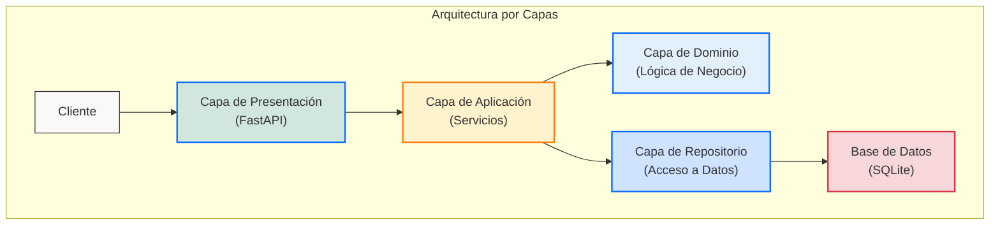
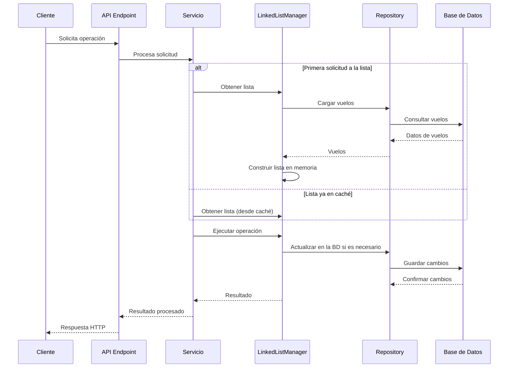
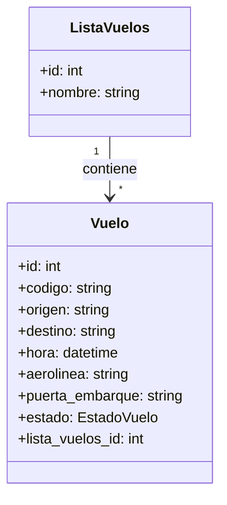
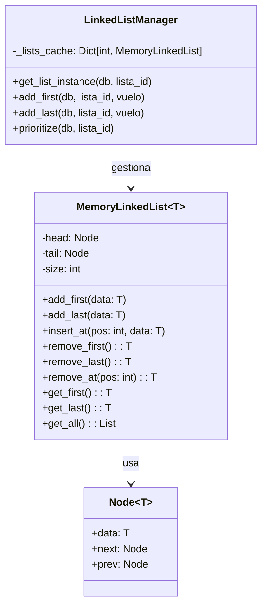
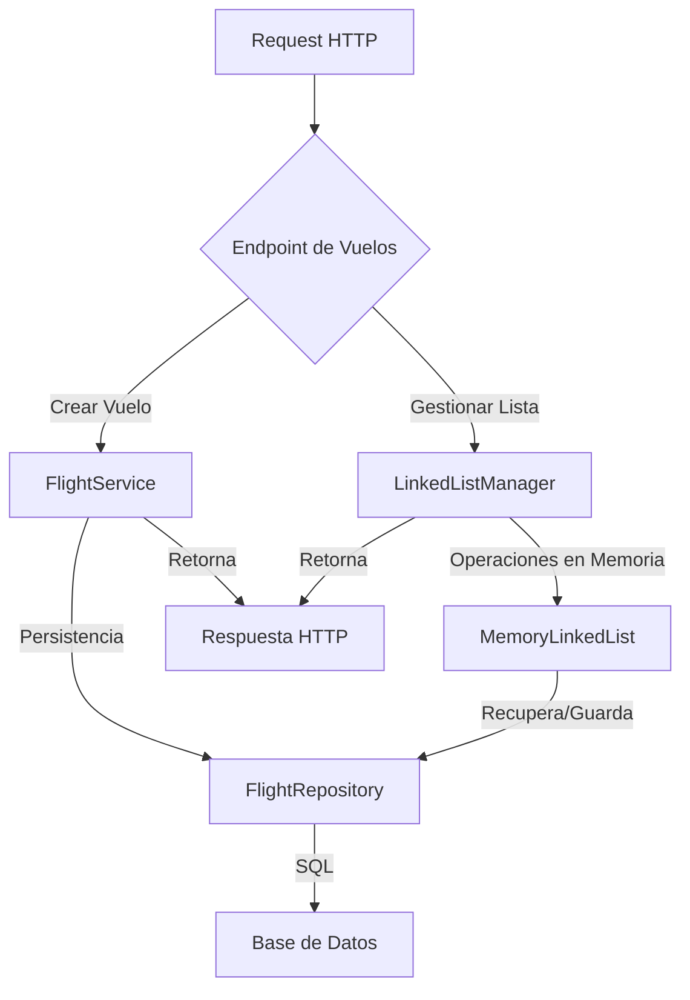

# Sistema de Gestión de Aeropuerto - Documentación de Arquitectura

## Arquitectura del Sistema

El Sistema de Gestión de Aeropuerto sigue una arquitectura por capas y modular para asegurar la separación de responsabilidades, mantenibilidad y testabilidad. La implementación utiliza una estructura de datos de lista doblemente enlazada en memoria para gestionar los vuelos, con persistencia en la base de datos.

### Capas

1. **Capa de Presentación (API)**
   - Implementada usando FastAPI
   - Maneja peticiones y respuestas HTTP
   - Dirige llamadas API al servicio apropiado
   - Ubicada en `app/api/`

2. **Capa de Aplicación (Servicios)**
   - Contiene la lógica de aplicación
   - Coordina entre API, dominio y repositorios
   - Implementa operaciones complejas sobre datos de vuelos
   - Ubicada en `app/services/`

3. **Capa de Dominio**
   - Implementa la lógica de negocio
   - Contiene la implementación de la lista doblemente enlazada en memoria
   - Ubicada en `app/domain/`

4. **Capa de Repositorio**
   - Maneja operaciones de base de datos usando SQLAlchemy
   - Abstrae el acceso a datos para la capa de servicio
   - Ubicada en `app/repositories/`

5. **Capa de Base de Datos**
   - Configuración y gestión de conexiones a base de datos
   - Ubicada en `app/db/`

### Estructura del Proyecto Refactorizada

```mermaid
graph TD
    Root["app/"] --> API["api/"]
    API --> init1["__init__.py"]
    API --> flight["flight_routes.py"]
    API --> list["list_routes.py"]
    
    Root --> Services["services/"]
    Services --> init2["__init__.py"]
    Services --> service["flight_service.py"]
    Services --> linked["linked_list.py"]
    Services --> manager["linked_list_manager.py"]
    
    Root --> Domain["domain/"]
    Domain --> init_domain["__init__.py"]
    Domain --> memory_list["memory_linked_list.py"]
    Domain --> memory_node["in_memory_node.py"]
    
    Root --> Repos["repositories/"]
    Repos --> init_repo["__init__.py"]
    Repos --> flight_repo["flight_repository.py"]
    
    Root --> Schemas["schemas/"]
    Schemas --> init3["__init__.py"]
    Schemas --> vuelo["vuelo_schemas.py"]
    Schemas --> lista["lista_schemas.py"]
    
    Root --> DB["db/"]
    DB --> init4["__init__.py"]
    DB --> config["config.py"]
    
    Root --> init5["__init__.py"]
    
    Root --> Models["models/"]
    Models --> Base["Base.py"]
    Models --> Estado["EstadoVuelo.py"]
    Models --> ListaM["ListaVuelos.py"]
    Models --> Vuelo["Vuelo.py"]
    
    Docs["docs/"] --> api_doc["api_documentation.md"]
    Docs --> arq["architecture.md"]
    Docs --> visual["visual_guides.md"]
    Docs --> demo["demo_scenarios.md"]
```

## Patrón de Lista Doblemente Enlazada en Memoria

Una de las principales características de esta arquitectura es la implementación de la lista doblemente enlazada **exclusivamente en memoria**. Esto ofrece varias ventajas:

1. **Mayor Eficiencia**: Las operaciones en memoria son significativamente más rápidas que las operaciones de base de datos
2. **Implementación más Limpia**: Al separar la estructura de datos de la persistencia, se logra un código más modular
3. **Flexibilidad**: Es más fácil modificar la implementación de la lista sin afectar la persistencia

El sistema utiliza un **caché en memoria** para almacenar las listas enlazadas, que se construyen a partir de los datos de la base de datos cuando son requeridas. Esto proporciona una combinación óptima de rendimiento y persistencia.

## Modelo de Datos Simplificado

En la versión refactorizada del sistema, el modelo de datos se ha simplificado eliminando la tabla de nodos de la base de datos:

Esto se complementa con la estructura en memoria:

## Patrones de Diseño Implementados

### 1. Repository Pattern

Separa la lógica de acceso a datos de la lógica de negocio. Los repositorios (`FlightRepository` y `ListRepository`) abstraen las operaciones de base de datos.

### 2. Service Layer Pattern

Implementa la lógica de aplicación en servicios que coordinan entre capas (`FlightService` y `LinkedListManager`).

### 3. Adapter Pattern

El módulo `linked_list.py` actúa como un adaptador entre la API existente y la nueva implementación `LinkedListManager`.

### 4. Cache Pattern

`LinkedListManager` implementa un sistema de caché para las listas enlazadas en memoria.

### 5. Factory Method

Se utiliza en `LinkedListManager` para crear instancias de listas enlazadas según sea necesario.

## Flujo de Datos y Operaciones

## Sincronización y Consistencia

Para mantener la consistencia entre la estructura en memoria y los datos persistentes:

1. Cada operación que modifica la estructura de la lista también actualiza las relaciones en la base de datos
2. Cuando se modifica un estado de vuelo, se puede forzar una reconstrucción de la lista en memoria
3. La caché de listas se puede limpiar para forzar la recarga desde la base de datos

Este enfoque garantiza que las operaciones sean eficientes mientras se mantiene la persistencia de datos.

## Conclusión

La arquitectura refactorizada separa claramente las responsabilidades:

- **Datos Persistentes**: Vuelos y sus atributos, listas de vuelos
- **Estructura en Memoria**: Nodos y estructura de lista doblemente enlazada
- **Lógica de Negocio**: Reglas de priorización y gestión de vuelos

Esto resulta en un sistema más mantenible, con mejor rendimiento y mayor flexibilidad para cambios futuros.
