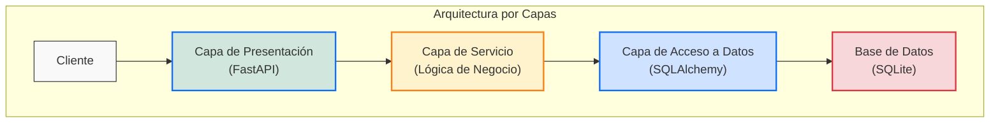
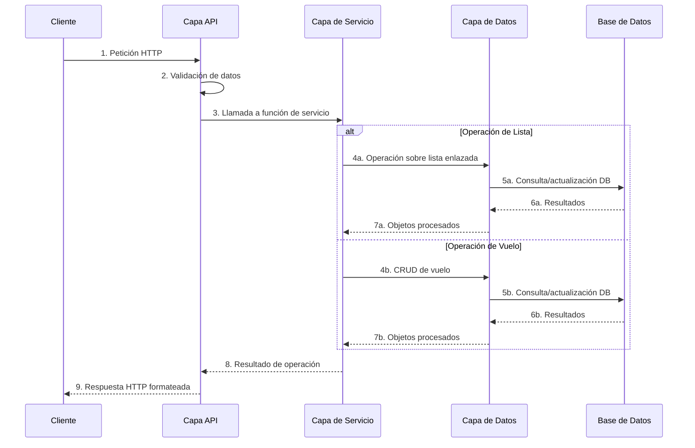
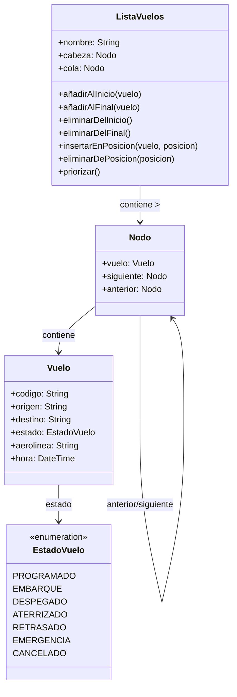
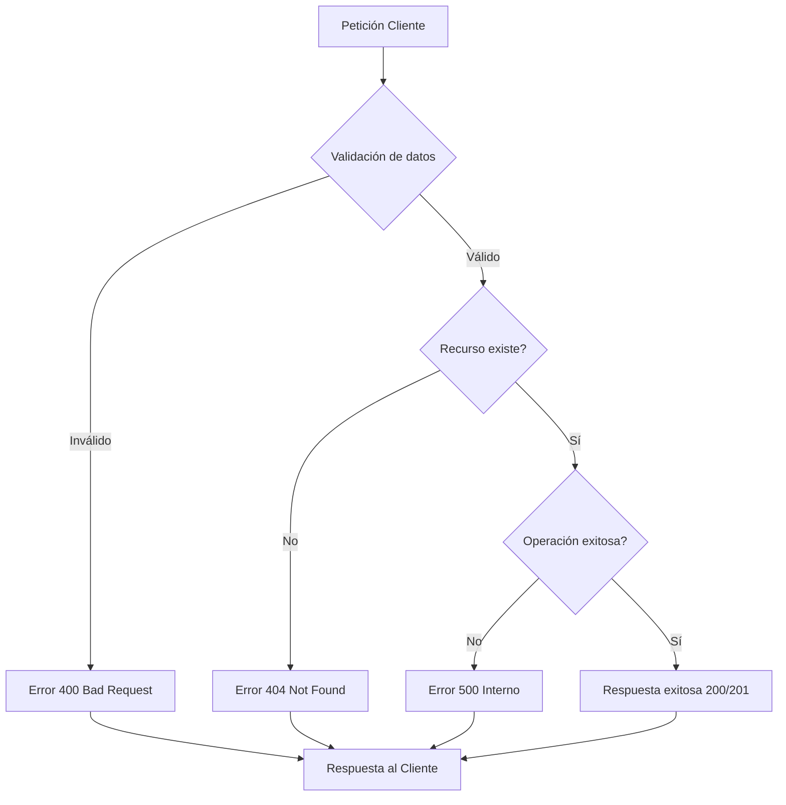

# Sistema de Gestión de Aeropuerto - Documentación de Arquitectura

## Arquitectura del Sistema

El Sistema de Gestión de Aeropuerto sigue un patrón de arquitectura por capas y modular para asegurar la separación de responsabilidades, mantenibilidad y testabilidad.

### Capas

1. **Capa de Presentación**
   - Implementada usando FastAPI
   - Maneja peticiones y respuestas HTTP
   - Dirige llamadas API al servicio apropiado
   - Ubicada en `app/api/`

2. **Capa de Servicio**
   - Contiene la lógica de negocio
   - Actúa como intermediario entre API y acceso a datos
   - Implementa operaciones complejas sobre datos de vuelos
   - Ubicada en `app/services/`

3. **Capa de Acceso a Datos**
   - Maneja operaciones de base de datos usando SQLAlchemy
   - Define modelos de base de datos, esquemas y acceso a datos
   - Ubicada en `app/models/`, `app/schemas.py`, y `app/db.py`

4. **Capa de Infraestructura**
   - Configuración y gestión de conexiones a base de datos
   - Ubicada en `app/db.py`

### Estructura de Directorios Actual

```mermaid
graph TD
    Root["app/"] --> API["api/"]
    API --> init1["__init__.py"]
    API --> flight["flight_routes.py"]
    API --> list["list_routes.py"]
    
    Root --> Services["services/"]
    Services --> init2["__init__.py"]
    Services --> service["flight_service.py"]
    Services --> linked["linked_list.py"]
    
    Root --> Schemas["schemas/"]
    Schemas --> init3["__init__.py"]
    Schemas --> vuelo["vuelo_schemas.py"]
    Schemas --> lista["lista_schemas.py"]
    
    Root --> DB["db/"]
    DB --> init4["__init__.py"]
    DB --> config["config.py"]
    
    Root --> init5["__init__.py"]
    
    Root --> Models["models/"]
    Models --> Base["Base.py"]
    Models --> Estado["EstadoVuelo.py"]
    Models --> ListaM["ListaVuelos.py"]
    Models --> Nodo["Nodo.py"]
    Models --> Vuelo["Vuelo.py"]
    
    Docs["docs/"] --> api_doc["api_documentation.md"]
    Docs --> arq["architecture.md"]
    Docs --> visual["visual_guides.md"]
    Docs --> demo["demo_scenarios.md"]
```

## Flujo de Datos

## Componentes Clave

### Implementación de Lista Doblemente Enlazada

El sistema utiliza una lista doblemente enlazada para gestionar vuelos, con estos componentes clave:

### Gestión de Vuelos

- Creación, recuperación y actualización de estado de vuelos
- Priorización de vuelos basada en estado (emergencias primero)
- Operaciones de lista como insertar, eliminar y reordenar vuelos

## Autenticación y Autorización

La implementación actual no incluye autenticación ni autorización. En un entorno de producción, se implementaría:

- Autenticación basada en JWT
- Control de acceso basado en roles
- Validación de claves de API

## Manejo de Errores

## Conclusión

Esta arquitectura proporciona una base sólida para el Sistema de Gestión de Aeropuerto, enfatizando:

- Modularidad y separación de responsabilidades
- Escalabilidad mediante diseño por capas
- Mantenibilidad con responsabilidades claras de los componentes
- Testabilidad con componentes aislados e interfaces bien definidas
