# Guías Visuales - Sistema de Gestión de Aeropuerto

## Lista Doblemente Enlazada: Visualización y Operaciones

### Estructura Básica

La lista doblemente enlazada es la estructura de datos fundamental que utilizamos para gestionar los vuelos. A continuación se muestra una representación visual de esta estructura:

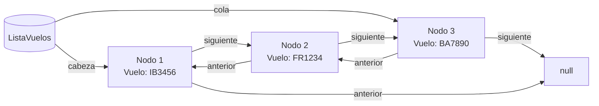

### Operaciones Básicas

#### 1. Añadir al Principio (add_first)

Añade un nuevo nodo al inicio de la lista.

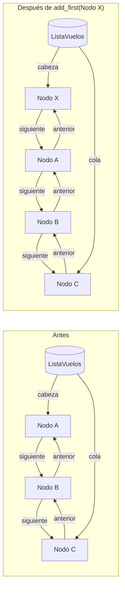

#### 2. Añadir al Final (add_last)

Añade un nuevo nodo al final de la lista.

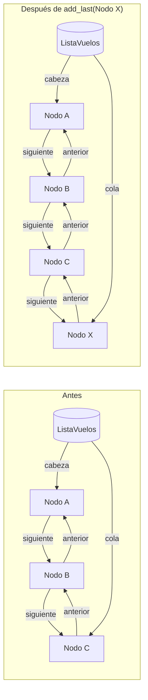

#### 3. Eliminar del Principio (remove_first)

Elimina el primer nodo de la lista.

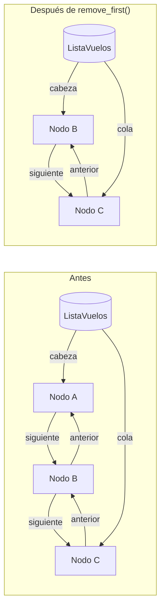

#### 4. Eliminar del Final (remove_last)

Elimina el último nodo de la lista.

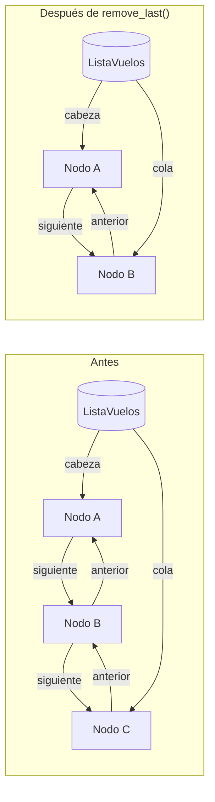

#### 5. Insertar en Posición (add_at_position)

Inserta un nodo en una posición específica.

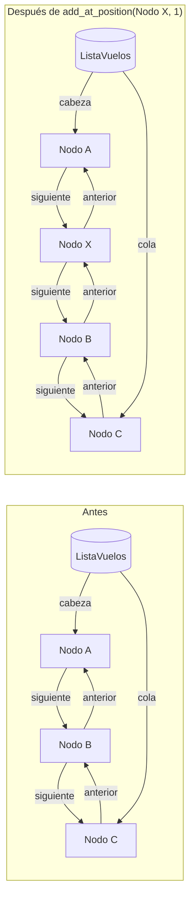

#### 6. Eliminar de Posición (remove_at_position)

Elimina un nodo de una posición específica.

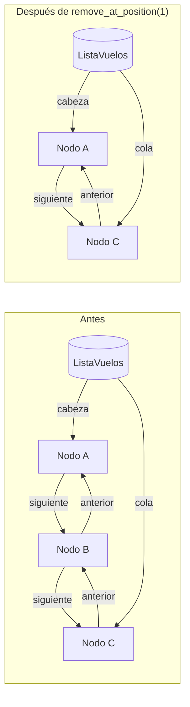

### Casos Especiales

#### Lista Vacía

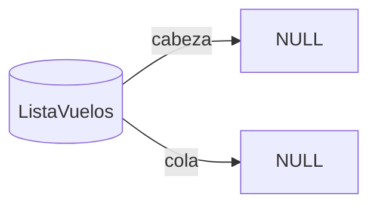

#### Lista con Un Solo Elemento

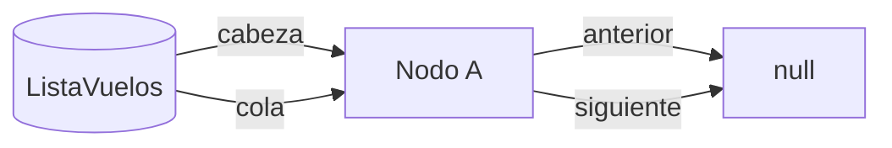

### Priorización de Vuelos

La operación `prioritize_flights` reorganiza la lista según el estado de los vuelos:

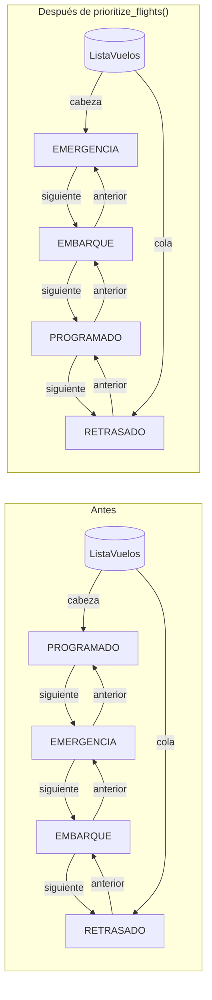

### Representación en Base de Datos

En nuestra implementación, la lista doblemente enlazada se representa mediante tres tablas principales:

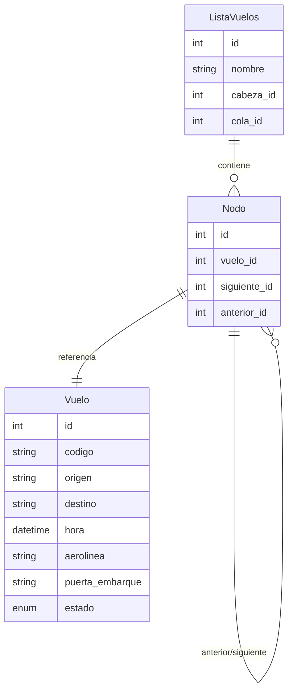

### Visualización de Estados de Vuelos

Cada vuelo tiene un estado que determina su prioridad en la lista:

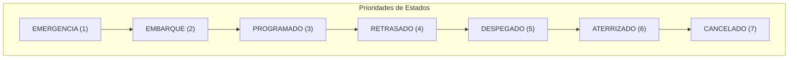

### Flujo de Operaciones API

Este diagrama muestra cómo las operaciones API interactúan con la lista doblemente enlazada:

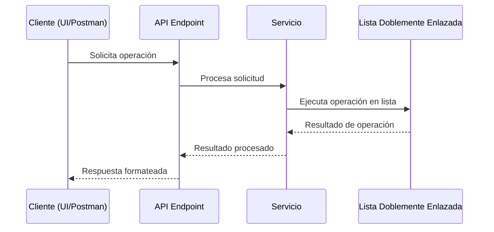

